# 漫谈统计分析

<small> [陈堰平](http://weibo.com/rucypchen) </small>

<script src="http://ajax.googleapis.com/ajax/libs/jquery/1.9.1/jquery.min.js"></script>


--- &vertical

## 统计与数据挖掘

- 统计分析
    * EDA（探索性数据分析）
    * CDA（验证性数据分析）
- 机器学习
- 数据挖掘
- 商务智能

--- &vertical

## 常用统计方法

- 描述统计
- 回归分析
- 判别分析
- 聚类分析
- ……


*** 

## 数据类型

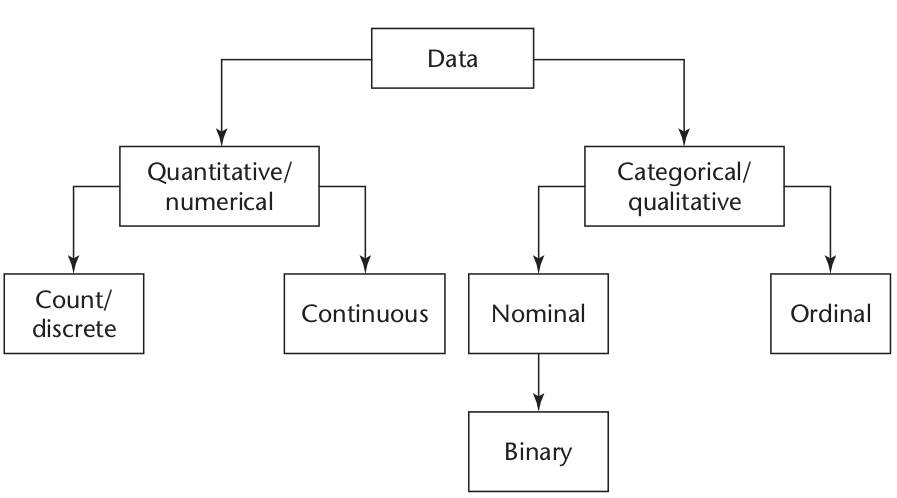

*** 

## 方法要与数据类型对应

- 回归分析： $g(y)=\beta_{0}+\beta_{1}x_{1}+...+\beta_{k}x_{k}$

- y为连续变量 &rarr; 普通线性回归
- 广义线性模型
    * y为0-1变量、定序变量、分类变量 &rarr; Logistic回归
    * y为计数变量 &rarr; 泊松回归

*** 

## 描述统计

*** 

## 案例：发改委打的飞机？

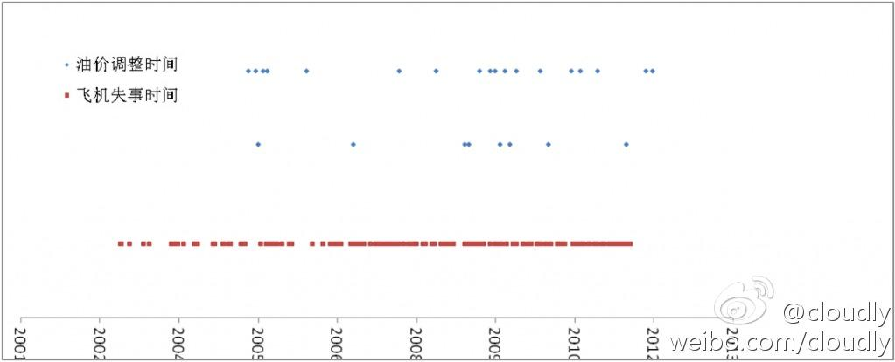

[查看原文](http://goo.gl/vWJ4T)

--- &vertical

## 机器学习

***  

## 有监督的学习

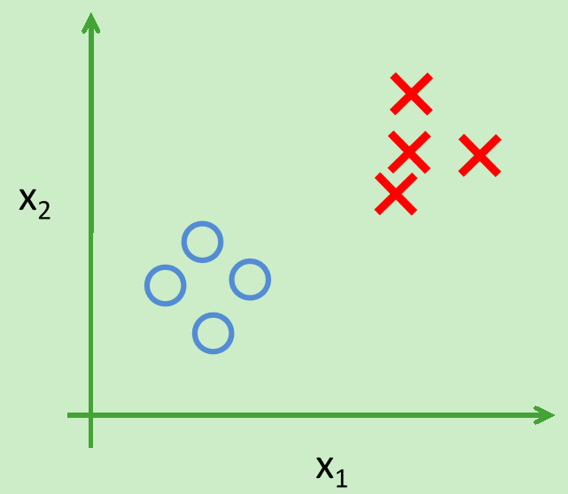

***  

## 无监督的学习

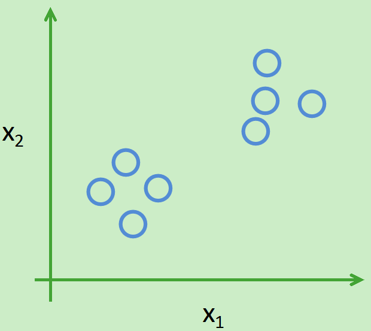

--- &vertical

## 数据挖掘

- 精准广告、直效行销（Direct Marketing）
- 银行业：信用卡评分、客户关系管理（CRM）
- 制造业和医疗
- 欺诈行为预测（Fraud Detection）
- ……

***

## 案例：购物篮分析 - 关联规则

啤酒与尿布的故事

***

## 案例：决策树 - 分类问题

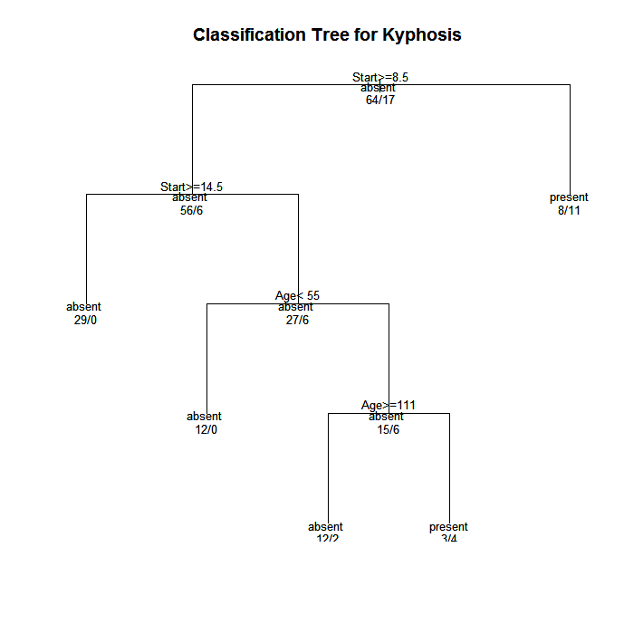

***

## 案例：聚类问题

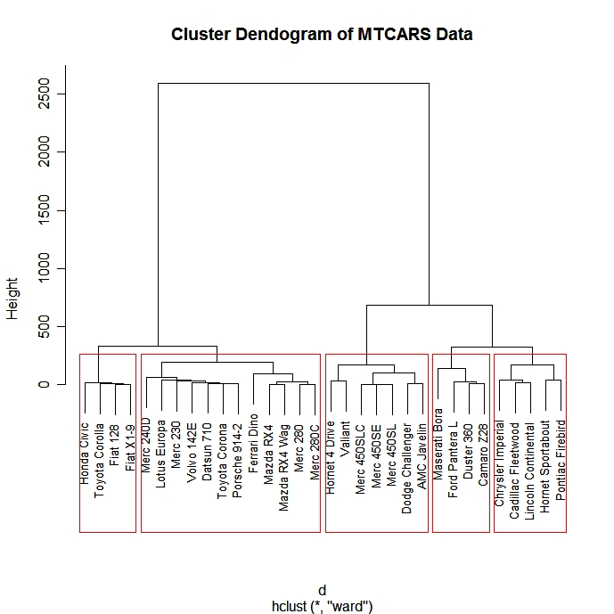

***

## 案例：文本挖掘（1）


***

## 

针对22996首中文歌曲（844个流行歌手）的[歌词分析](http://www.bjt.name/2012/02/love-always-lonely/)

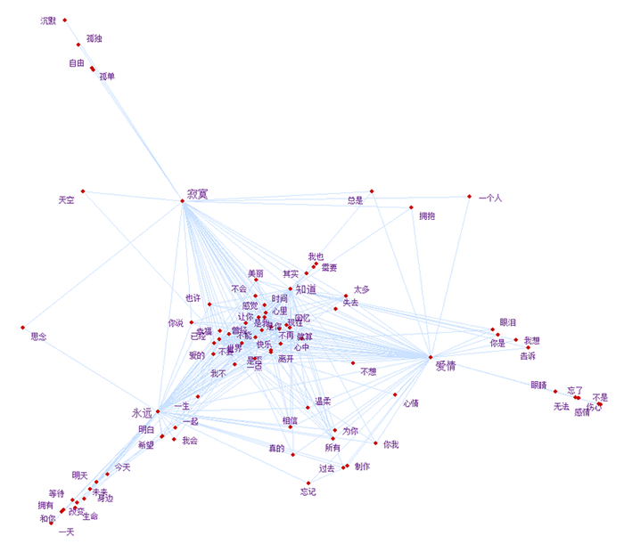

--- ds:soothe &vertical

## 常用统计工具软件介绍 

***

## Excel


[Stop Clicking, Start Typing!](mwfrost.com/r_slides/r_slides.html)

***

## SPSS

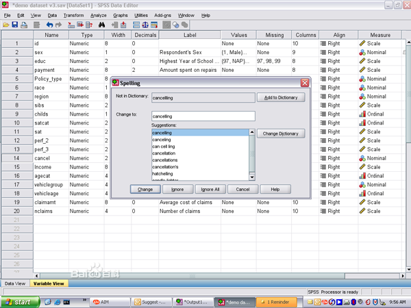

***

## PSPP

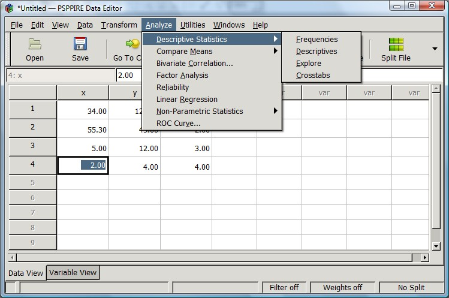

山寨版的SPSS，[开源的](http://www.gnu.org/software/pspp/)

*** 

## SAS

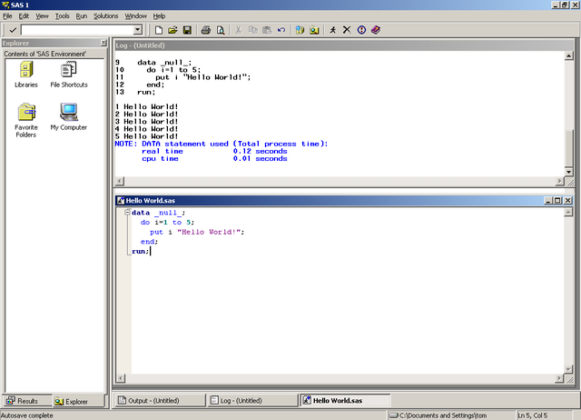


***

## R

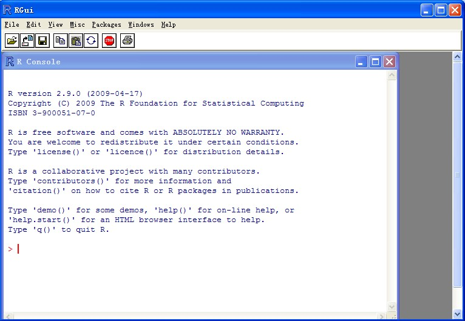

***

## 用R做图


```r
library(ggplot2)
qplot(wt, mpg, data = mtcars)
```

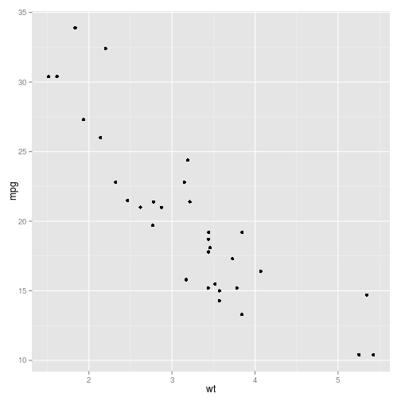 


***

## 基础绘图案例


```r
# Scatterplot
x <- c(0.5, 2, 4, 8, 12, 16)
y1 <- c(1, 1.3, 1.9, 3.4, 3.9, 4.8)
y2 <- c(4, 0.8, 0.5, 0.45, 0.4, 0.3)
```

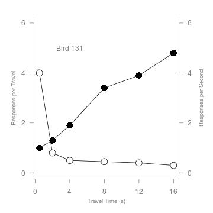 


*** 

## 直方图


```r
Y <- rnorm(50)
```


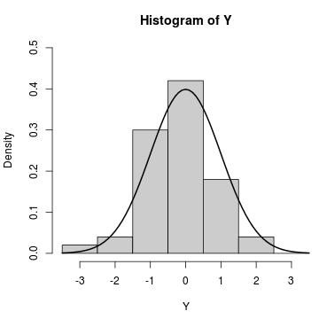 


*** 

## 动画图

```r
library(animation)
example(animation)
```

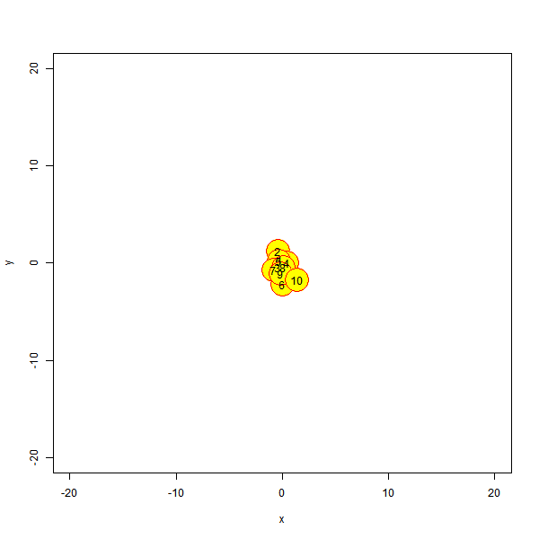

***

## 可视化案例

- [气泡图](http://player.opengg.me/loader.swf?VideoIDS=XNDk4MjYyMTUy)


***

## 大航海时代


[查看原文](http://yihui.name/en/2012/04/fancy-html5-slides-with-knitr-and-pandoc/)

*** 

## R的IDE：RStudio


*** 

## R的IDE：Emacs+ESS

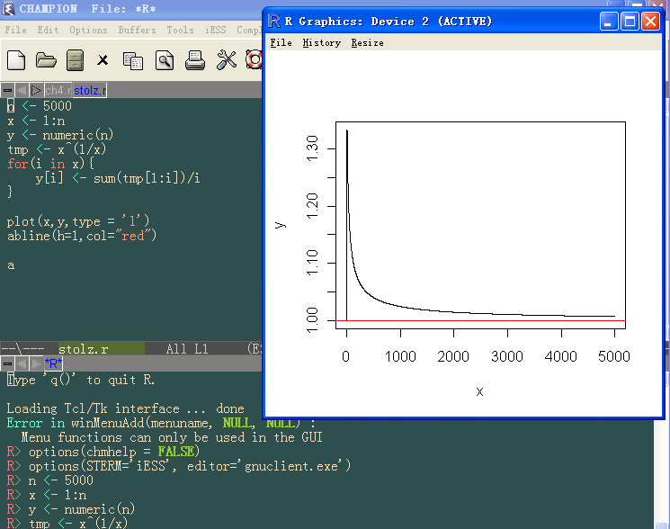

*** 

## R的IDE：Notepad++ & NppToR

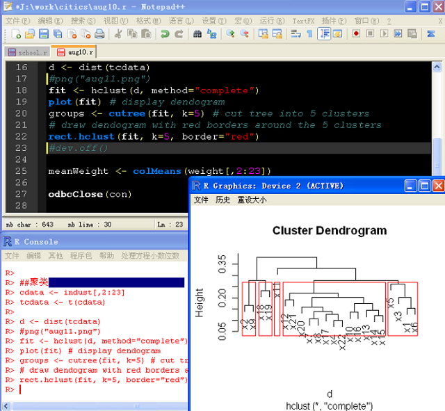

*** 

## 穿马甲的R（1）：Rcmdr

```r
install.packages("Rcmdr")
library(Rcmdr)
```

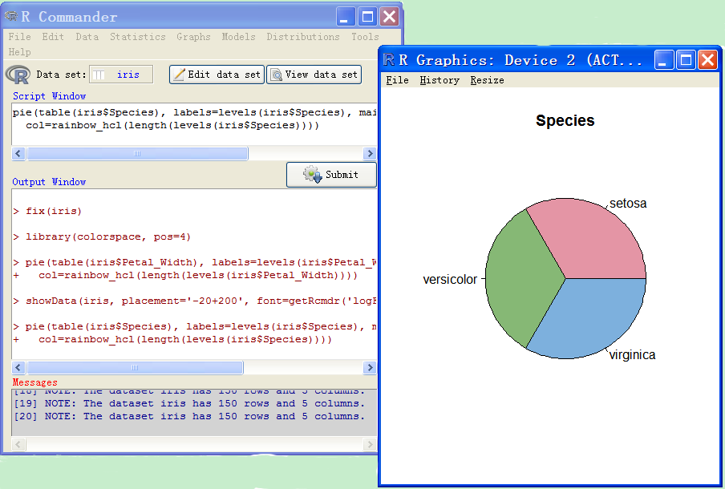

*** 

## 穿马甲的R（2）：rattle

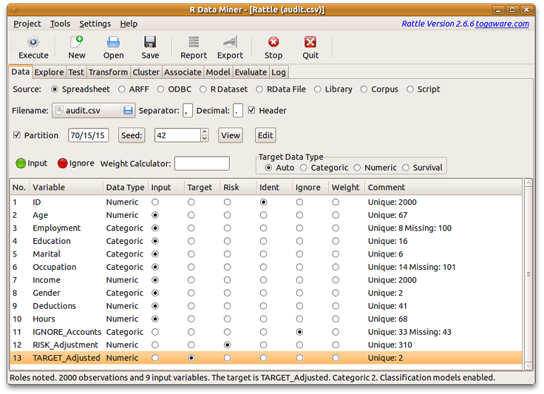

*** 

## 几种软件的比较

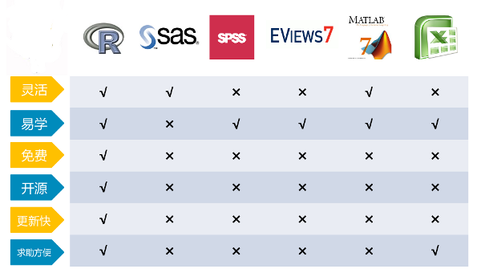

*** 


<small><a href="http://www.bjt.name/2012/05/2012-datamining-software/">2012年第13期KDnuggets关于数据挖掘软件的调查</a></small>

--- ds:indigo &vertical

## 统计学习资源介绍

*** 

## 

- [统计之都](http://cos.name)
- [炼数成金](http://www.dataguru.cn)
- 统计学：从数据到结论
- 数据之美
- New Internet：大数据挖掘
- [R菜鸟入门](http://dapengde.com/r4dummies/)
- [《153 分钟学会 R》](http://cran.r-project.org/doc/contrib/Liu-FAQ.pdf) 
- [R参考卡片](http://cran.r-project.org/doc/contrib/Liu-R-refcard.pdf)
- [R语言实战](http://product.dangdang.com/product.aspx?product_id=22928480)
- R语言编程艺术
- [数据挖掘与R语言](http://product.dangdang.com/product.aspx?product_id=23228225)
- ……

---

## 关于统计之都


<script>
$('ul.incremental li').addClass('fragment')
</script>
